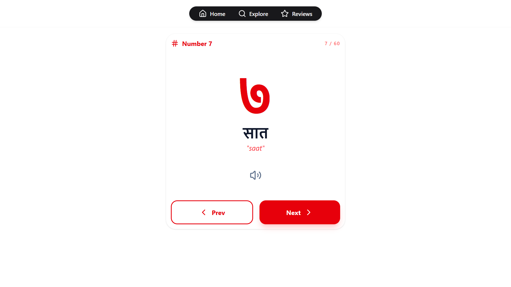

# LearnAnka
- App for learning learning nepali numbers from 1-100.
> was procastination to build this and i am also cooked by nepali numbers.

# Teach stack
- Vite + Reactjs
- Tailwindcss,Lucide-React
- Hardcoded Dataset
- React Router
- Local storage to store the state of user
- SpeechSynthesis for pronunciation 

# Features
- 1-100 nepali numbers with (roman writing)
- Voice pronunciation(tbh 6/10)
- Explore to see specific number

# Design

[More Designs](./design)

---
Give it a star if you liked it 😂.